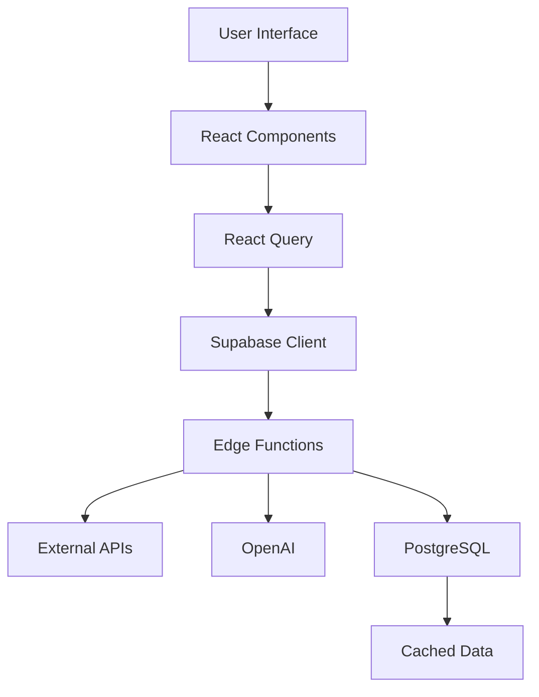

# 🚀 EquiSight - Open Source AI-Powered Equity Research Platform

<div align="center">


**A comprehensive, AI-powered equity research platform for investment professionals, analysts, and individual investors**

[](https://opensource.org/licenses/MIT)
[](https://typescriptlang.org)
[](https://reactjs.org)
[](https://supabase.com)
[](https://tailwindcss.com)

[🌐 Live Demo](https://your-domain.com) • [📖 Documentation](https://docs.your-domain.com) • [🚀 Deploy](#-deployment) • [🤝 Contributing](#-contributing)

</div>

---

## 📋 Table of Contents

- [✨ Features](#-features)
- [🏗️ Architecture](#️-architecture)
- [🚀 Quick Start](#-quick-start)
- [⚙️ Installation](#️-installation)
- [🔐 Environment Setup](#-environment-setup)
- [📡 API Documentation](#-api-documentation)
- [🎨 Usage Guide](#-usage-guide)
- [🚀 Deployment](#-deployment)
- [🤝 Contributing](#-contributing)
- [🔒 Security](#-security)
- [📄 License](#-license)
- [🙏 Acknowledgments](#-acknowledgments)

---

## ✨ Features

### 🔍 **Comprehensive Stock Analysis**
- **Intelligent Stock Search**: Fast, fuzzy search with autocomplete and recent searches
- **Company Profiles**: Detailed company information, key metrics, and ratings
- **Financial Statements**: Income statements, balance sheets, and cash flow analysis
- **Growth Analytics**: Revenue growth, profitability trends, and key ratio analysis
- **Market Data**: Real-time quotes, historical charts, and market performance

### 🤖 **AI-Powered Insights**
- **Research Reports**: Generate comprehensive investment research reports using OpenAI
- **Price Predictions**: AI-powered stock price forecasts for 3, 6, and 12-month horizons
- **Risk Assessment**: Automated risk analysis and key investment drivers
- **Sentiment Analysis**: Market sentiment evaluation from news and social media

### 📄 **Document Analysis**
- **SEC Filings**: Access and analyze 10-K, 10-Q, 8-K, and other regulatory filings
- **Earnings Transcripts**: Full earnings call transcripts with AI-generated highlights
- **Document Search**: Semantic search across company documents
- **Financial Extraction**: Automated extraction of key financial metrics from documents

### 💼 **Professional Tools**
- **Saved Content**: Organize and manage research reports and predictions
- **User Profiles**: Professional profile management for investment professionals
- **Export Capabilities**: Download reports in HTML format
- **Dark/Light Themes**: Customizable interface for different preferences

### 🔐 **Security & Authentication**
- **Row-Level Security**: Secure data access with Supabase RLS
- **User Authentication**: Secure login with email verification
- **API Rate Limiting**: Protected endpoints with proper rate limiting
- **Data Encryption**: All sensitive data encrypted at rest and in transit

---

## 🏗️ Architecture

### **Frontend Stack**
```
├── React 18 + TypeScript     # Component-based UI with type safety
├── Tailwind CSS + Shadcn/ui   # Utility-first styling with accessible components
├── React Router Dom           # Client-side routing
├── React Query               # Data fetching, caching, and synchronization
├── Framer Motion             # Smooth animations and transitions
├── Recharts                  # Data visualization and charting
└── Lucide React              # Beautiful, customizable icons
```

### **Backend Stack**
```
├── Supabase                  # Backend-as-a-Service
│   ├── PostgreSQL           # Primary database
│   ├── Row Level Security    # Data access control
│   ├── Edge Functions        # Serverless API endpoints
│   └── Real-time Updates     # Live data synchronization
├── OpenAI GPT-4             # AI report generation and analysis
├── Multiple Data Providers   # Financial data aggregation
└── SEC EDGAR API            # Official regulatory filings
```

### **Data Flow**


---

## 🚀 Quick Start

Get EquiSight running locally in less than 5 minutes:

```bash
# Clone the repository
git clone https://github.com/your-username/opensource-ai-equity-research.git
cd opensource-ai-equity-research

# Install dependencies
npm install

# Set up environment variables (see below)
cp .env.example .env.local

# Start the development server
npm run dev
```

Visit [http://localhost:5173](http://localhost:5173) to see your app running!

---

## ⚙️ Installation

### **Prerequisites**
- **Node.js** (v18 or higher)
- **npm** or **yarn**
- **Supabase account** (free tier available)
- **OpenAI API key** (for AI features)

### **Step-by-Step Setup**

1. **Clone and Install**
   ```bash
   git clone https://github.com/your-username/opensource-ai-equity-research.git
   cd opensource-ai-equity-research
   npm install
   ```

2. **Set up Supabase**
   - Create a new project at [supabase.com](https://supabase.com)
   - Copy your project URL and anon key
   - Run database migrations (see [Database Setup](#database-setup))

3. **Configure Environment Variables**
   ```bash
   cp .env.example .env.local
   # Edit .env.local with your API keys (see Environment Setup below)
   ```

4. **Start Development**
   ```bash
   npm run dev
   ```

### **Database Setup**

The project includes comprehensive database migrations. Run them in your Supabase SQL editor:

```sql
-- Enable necessary extensions
CREATE EXTENSION IF NOT EXISTS "uuid-ossp";
CREATE EXTENSION IF NOT EXISTS "pg_trgm";

-- Run migrations from supabase/migrations/ directory
-- (Copy and paste each migration file in chronological order)
```

---

## 🔐 Environment Setup

### **Required API Keys**

Create accounts and obtain API keys from these providers:

| Service | Purpose | Required | Free Tier |
|---------|---------|----------|-----------|
| [Supabase](https://supabase.com) | Database & Auth | ✅ | ✅ |
| [OpenAI](https://platform.openai.com) | AI Analysis | ✅ | ❌ |
| [Financial Modeling Prep](https://financialmodelingprep.com) | Financial Data | ✅ | ✅ |
| [Finnhub](https://finnhub.io) | Market Data | ✅ | ✅ |
| [Polygon.io](https://polygon.io) | Alternative Data | ⚠️ Optional | ✅ |

### **Environment Configuration**

The application uses Supabase's secrets management. Set up these secrets in your Supabase dashboard:

```bash
# Go to Supabase Dashboard → Settings → Edge Functions → Add Secret
OPENAI_API_KEY=your_openai_api_key_here
FMP_API_KEY=your_fmp_api_key_here
FINNHUB_API_KEY=your_finnhub_api_key_here
POLYGON_API_KEY=your_polygon_api_key_here  # Optional
```

### **Local Development**

For local development, the app connects directly to your Supabase project. No additional `.env` files are needed as credentials are managed through Supabase.

---

## 📡 API Documentation

### **Edge Functions**

The application includes several Supabase Edge Functions for secure API communication:

#### **Stock Data (`get-stock-data`)**
```typescript
// GET /functions/v1/get-stock-data
{
  symbol: string;
  endpoint: 'profile' | 'financials' | 'ratios' | 'growth';
  period?: 'annual' | 'quarter';
  limit?: number;
}
```

#### **Research Reports (`generate-research-report`)**
```typescript
// POST /functions/v1/generate-research-report
{
  symbol: string;
  companyName: string;
  analysisType: 'comprehensive' | 'technical' | 'fundamental';
}
```

#### **Price Predictions (`predict-stock-price`)**
```typescript
// POST /functions/v1/predict-stock-price
{
  symbol: string;
  timeframe: '3m' | '6m' | '12m';
  includeRiskAnalysis: boolean;
}
```

### **Database Schema**

Key database tables:

```sql
-- User profiles with professional information
profiles (
  id uuid PRIMARY KEY,
  first_name text,
  last_name text,
  firm_name text,
  job_role text,
  industry text,
  -- Additional fields...
)

-- Saved research reports
user_research_reports (
  id uuid PRIMARY KEY,
  user_id uuid REFERENCES profiles(id),
  symbol text,
  report_data jsonb,
  html_content text,
  -- Additional fields...
)

-- Price predictions history
user_price_predictions (
  id uuid PRIMARY KEY,
  user_id uuid REFERENCES profiles(id),
  symbol text,
  prediction_data jsonb,
  -- Additional fields...
)
```

---

## 🎨 Usage Guide

### **For Investment Professionals**

1. **Create Professional Profile**
   - Sign up with work email
   - Complete profile with firm and role information
   - Access unlimited research capabilities

2. **Generate Research Reports**
   - Search for any public stock symbol
   - Navigate to "Research" tab
   - Select analysis type and generate comprehensive reports
   - Save and export reports for client presentations

3. **Price Forecasting**
   - Use AI-powered price predictions for target setting
   - Analyze risk factors and key drivers
   - Track prediction accuracy over time

### **For Individual Investors**

1. **Quick Stock Analysis**
   - Search stocks using ticker or company name
   - Review financial health and growth trends
   - Access recent SEC filings and earnings calls

2. **Free Predictions**
   - Get 5 free AI price predictions
   - Sign up for unlimited access
   - Save interesting analyses for later review

### **For Developers**

1. **Extending Functionality**
   - Add new data providers in `src/services/api/`
   - Create custom analysis tools in `src/components/analysis/`
   - Build new visualizations with Recharts

2. **Custom Deployments**
   - Deploy to Vercel, Netlify, or custom infrastructure
   - Configure environment variables for your data sources
   - Customize branding and styling

---

## 🚀 Deployment

### **Lovable Platform (Recommended)**

The easiest deployment option:

1. Connect your GitHub repository to Lovable
2. Configure your Supabase secrets in the Lovable dashboard
3. Deploy with one click
4. Automatic deployments on every push

### **Vercel Deployment**

```bash
# Install Vercel CLI
npm i -g vercel

# Deploy
vercel

# Configure environment variables in Vercel dashboard
# Point to your Supabase project
```

### **Self-Hosted Deployment**

```bash
# Build for production
npm run build

# Deploy to your preferred hosting platform
# Configure environment variables:
# - VITE_SUPABASE_URL
# - VITE_SUPABASE_ANON_KEY
```

### **Docker Deployment**

```dockerfile
FROM node:18-alpine
WORKDIR /app
COPY package*.json ./
RUN npm ci --only=production
COPY . .
RUN npm run build
EXPOSE 3000
CMD ["npm", "run", "preview"]
```

---

## 🤝 Contributing

We welcome contributions from the community! Here's how to get started:

### **Development Setup**

1. **Fork and Clone**
   ```bash
   git clone https://github.com/your-username/opensource-ai-equity-research.git
   cd opensource-ai-equity-research
   git remote add upstream https://github.com/original-owner/opensource-ai-equity-research.git
   ```

2. **Create Feature Branch**
   ```bash
   git checkout -b feature/your-amazing-feature
   ```

3. **Make Changes and Test**
   ```bash
   npm run dev      # Development server
   npm run test     # Run tests
   npm run lint     # Check code style
   npm run build    # Test production build
   ```

4. **Submit Pull Request**
   - Push your changes to your fork
   - Create a pull request with clear description
   - Link any related issues

### **Contribution Guidelines**

- **Code Style**: Follow TypeScript and React best practices
- **Commits**: Use conventional commit messages (`feat:`, `fix:`, `docs:`, etc.)
- **Testing**: Add tests for new features
- **Documentation**: Update docs for any API changes
- **Security**: Never commit API keys or sensitive data

### **Areas for Contribution**

- 🐛 **Bug Fixes**: Check our [Issues](https://github.com/your-username/opensource-ai-equity-research/issues)
- ✨ **New Features**: Portfolio tracking, advanced analytics, mobile app
- 📚 **Documentation**: Improve guides and API docs
- 🎨 **UI/UX**: Design improvements and accessibility
- 🔧 **DevOps**: CI/CD, testing, deployment optimizations
- 🌐 **Integrations**: New data providers and trading platforms

---

## 🔒 Security

Security is a top priority for EquiSight. We implement multiple layers of protection:

### **Data Security**
- **Row-Level Security (RLS)**: All database tables use Supabase RLS
- **API Authentication**: All endpoints require proper authentication
- **Data Encryption**: Sensitive data encrypted at rest and in transit
- **Input Validation**: All user inputs sanitized and validated

### **Infrastructure Security**
- **HTTPS Only**: All traffic encrypted with TLS
- **CORS Protection**: Proper CORS headers on all API endpoints
- **Rate Limiting**: API rate limiting to prevent abuse
- **SQL Injection Protection**: Parameterized queries only

### **Reporting Security Issues**

If you discover a security vulnerability, please report it responsibly:

1. **DO NOT** create a public GitHub issue
2. Email us at security@your-domain.com
3. Include detailed information about the vulnerability
4. We'll respond within 24 hours

### **Security Best Practices for Contributors**

- Never commit API keys, passwords, or sensitive data
- Use environment variables for all configuration
- Follow OWASP security guidelines
- Test for common vulnerabilities (XSS, CSRF, etc.)

---

## 📄 License

This project is licensed under the MIT License - see the [LICENSE](LICENSE) file for details.

### **MIT License Summary**
- ✅ Commercial use allowed
- ✅ Modification allowed  
- ✅ Distribution allowed
- ✅ Private use allowed
- ❗ License and copyright notice required
- ❗ No warranty provided

---

## 🙏 Acknowledgments

### **Open Source Libraries**
- [React](https://reactjs.org) - UI framework
- [Supabase](https://supabase.com) - Backend-as-a-Service
- [Tailwind CSS](https://tailwindcss.com) - Utility-first CSS
- [Shadcn/ui](https://ui.shadcn.com) - Component library
- [Recharts](https://recharts.org) - Data visualization
- [Framer Motion](https://framer.com/motion) - Animation library

### **Data Providers**
- [Financial Modeling Prep](https://financialmodelingprep.com) - Financial data API
- [Finnhub](https://finnhub.io) - Stock market data
- [SEC EDGAR](https://sec.gov/edgar) - Official company filings
- [OpenAI](https://openai.com) - AI-powered analysis

### **Community**
- All contributors and users who help improve the platform
- Investment professionals who provide feedback and feature requests
- The open-source community for inspiration and best practices

---

<div align="center">

**Made with ❤️ for the investment community**

[⭐ Star this repo](https://github.com/your-username/opensource-ai-equity-research) • [🐛 Report Bug](https://github.com/your-username/opensource-ai-equity-research/issues) • [💡 Request Feature](https://github.com/your-username/opensource-ai-equity-research/issues)

</div>